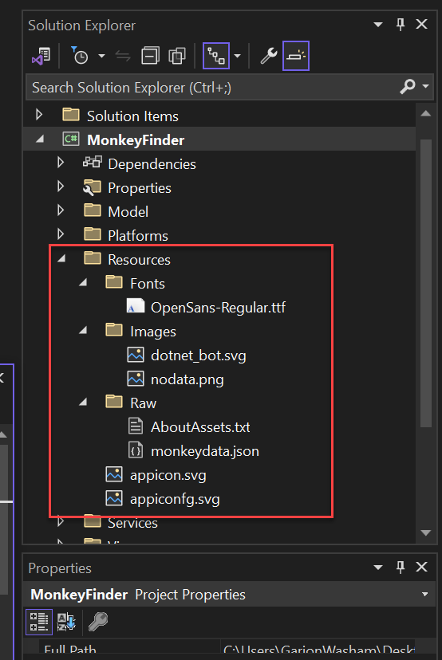
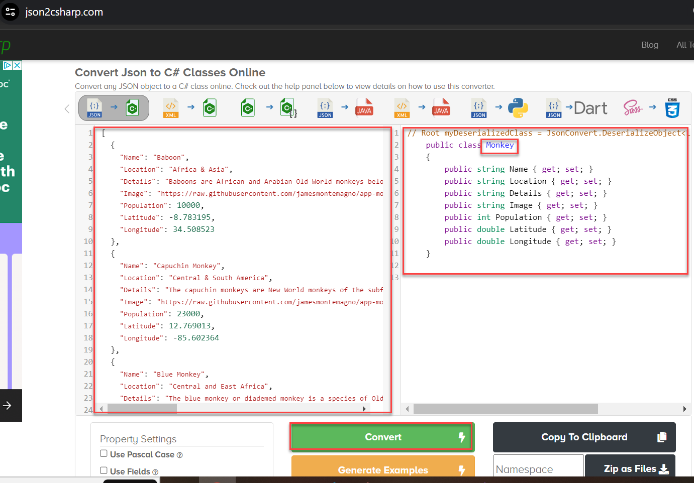
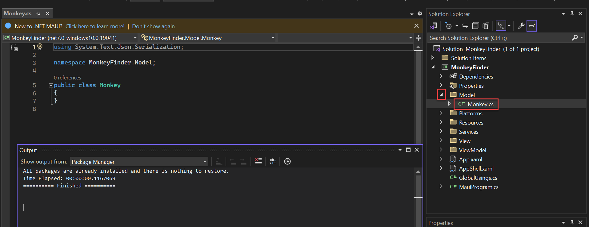
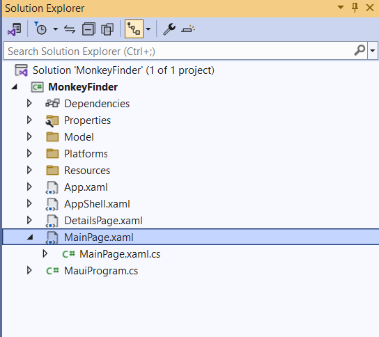
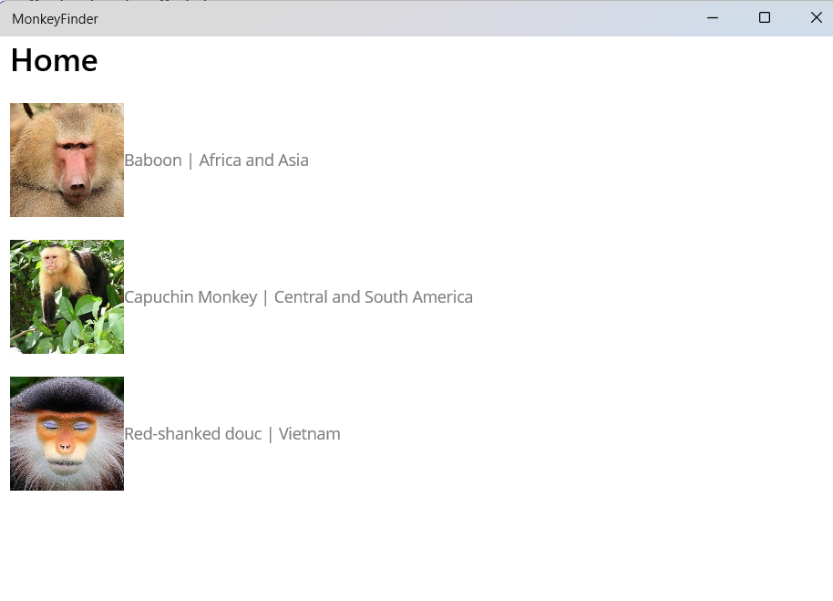
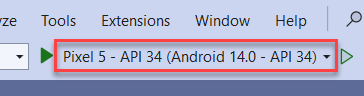
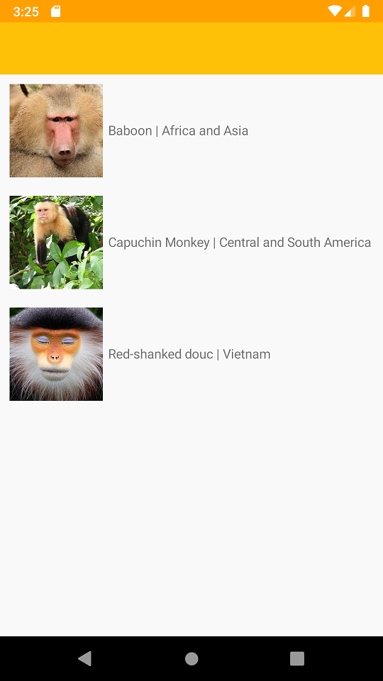

## Orientation to .NET Maui 

## Overview

Let's start by getting a basic overview of .NET MAUI and how projects are structured.
You won't do any work in this section except for downloading and opening the solution using Visual Studio 2022.

### Task 0: Open Solution in Visual Studio

1. Download the MonkeyFinder solution locally and extract it locally on your harddrive.  

    ```
    https://opsgilitylabs.blob.core.windows.net/public/software-dev/MonkeyFinder.zip
    ```

    **Important! Differences with running on a lab virtual machine** 

    If you are running the lab on a hosted virtual machine from Opsgility read the following: 

    1. If you are running on a lab virtual machine, you can use credentials to login to Visual Studio by clicking the Cloud Icon on the lab player.
    
    2. You will also be prompted to enable developer mode in Windows. Click the settings link and enable developer mode when prompted. 
    
    3. You may receive an errors that **ContentPage** and **InitializeComponent** are not found. This is a delay in Visual Studio and will resolve on it's own after a few minutes. 

    4. Do not use the Android emalator for execution. Choose the **Windows Machine** option to start the solution.

2. Open **MonkeyFinder.sln**. This solution contains 1 project, **MonkeyFinder**, the main .NET MAUI project that targets Android, iOS, macOS, and Windows. It includes all scaffolding for the app including Models, Views, ViewModels, and Services.

    

3. **Right-click** on the **Solution** and select **Rebuild**. The **MonkeyFinder** project also has blank code files and XAML pages that we will use during the lab. All of the code that we modify will be in this project for the duration of the lab.

> Informational only: The following sections are to help you understand more about .NET MAUI and the project structure. You do not make any changes until **Task 1**.

### Understanding the .NET MAUI single project

.NET Multi-platform App UI (.NET MAUI) single project takes the platform-specific development experiences you typically encounter while developing apps and abstracts them into a single shared project that can target Android, iOS, macOS, and Windows.

.NET MAUI single project provides a simplified and consistent cross-platform development experience, regardless of the platforms being targeted. .NET MAUI single project provides the following features:

- A single shared project that can target Android, iOS, macOS, and Windows.
- A simplified debug target selection for running your .NET MAUI apps.
- Shared resource files within the single project.
- Access to platform-specific APIs and tools when required.
- A single cross-platform app entry point.

.NET MAUI single project is enabled using multi-targeting and the use of SDK-style projects in .NET 6.

#### Resource files

Resource management for cross-platform app development has traditionally been problematic. Each platform has its own approach to managing resources, that must be implemented on each platform. For example, each platform has differing image requirements that typically involves creating multiple versions of each image at different resolutions. Therefore, a single image typically has to be duplicated multiple times per platform, at different resolutions, with the resulting images having to use different filename and folder conventions on each platform.

.NET MAUI single project enables resource files to be stored in a single location while being consumed on each platform. This includes fonts, images, the app icon, the splash screen, and raw assets.

> **IMPORTANT:** Each image resource file is used as a source image, from which images of the required resolutions are generated for each platform at build time.

Resource files should be placed in the _Resources_ folder of your .NET MAUI app project, or child folders of the _Resources_ folder, and must have their build action set correctly. The following table shows the build actions for each resource file type:

| Resource | Build action |
| -------- | ------------ |
| App icon | MauiIcon |
| Fonts | MauiFont |
| Images | MauiImage |
| Splash screen | MauiSplashScreen |
| Raw assets | MauiAsset |

<!--| CSS files | MauiCss | -->

> **NOTE:** XAML files are also stored in your .NET MAUI app project, and are automatically assigned the **MauiXaml** build action when created by project and item templates. However, XAML files will not typically be located in the _Resources_ folder of the app project.

When a resource file is added to a .NET MAUI app project, a corresponding entry for the resource is created in the project (.csproj) file. After adding a resource file, its build action can be set in the **Properties** window. The following screenshot shows a _Resources_ folder containing image and font resources in child folders:



Child folders of the _Resources_ folder can be designated for each resource type by editing the project file for your app:

```xml
<ItemGroup>
    <!-- Images -->
    <MauiImage Include="Resources\Images\*" />

    <!-- Fonts -->
    <MauiFont Include="Resources\Fonts\*" />

    <!-- Raw Assets (also remove the "Resources\Raw" prefix) -->
    <MauiAsset Include="Resources\Raw\**" LogicalName="%(RecursiveDir)%(Filename)%(Extension)" />
</ItemGroup>
```

The wildcard character (`*`) indicates that all the files within the folder will be treated as being of the specified resource type. In addition, it's possible to include all files from child folders:

```xml
<ItemGroup>
    <!-- Images -->
    <MauiImage Include="Resources\Images\**\*" />
</ItemGroup>
```

In this example, the double wildcard character ('**') specifies that the _Images_ folder can contain child folders. Therefore, `<MauiImage Include="Resources\Images\**\*" />` specifies that any files in the _Resources\Images_ folder, or any child folders of the _Images_ folder, will be used as source images from which images of the required resolution are generated for each platform.

Platform-specific resources will override their shared resource counterparts. For example, if you have an Android-specific image located at _Platforms\Android\Resources\drawable-xhdpi\logo.png_, and you also provide a shared _Resources\Images\logo.svg_ image, the Scalable Vector Graphics (SVG) file will be used to generate the required Android images, except for the XHDPI image that already exists as a platform-specific image.

### App icons

An app icon can be added to your app project by dragging an image into the _Resources\Images_ folder of the project, and setting the build action of the icon to **MauiIcon** in the **Properties** window. This creates a corresponding entry in your project file:

```xml
<MauiIcon Include="Resources\Images\appicon.png" />
```

At build time, the app icon is resized to the correct sizes for the target platform and device. The resized app icons are then added to your app package. App icons are resized to multiple resolutions because they have multiple uses, including being used to represent the app on the device, and in the app store.

#### Images

Images can be added to your app project by dragging them to the _Resources\Images_ folder of your project, and setting their build action to **MauiImage** in the **Properties** window. This creates a corresponding entry per image in your project file:

```xml
<MauiImage Include="Resources\Images\logo.jpg" />
```

At build time, images are resized to the correct resolutions for the target platform and device. The resized images are then added to your app package.

#### Fonts

True type format (TTF) and open type font (OTF) fonts can be added to your app project by dragging them into the _Resources\Fonts_ folder of your project, and setting their build action to **MauiFont** in the **Properties** window. This creates a corresponding entry per font in your project file:

```xml
<MauiFont Include="Resources\Fonts\OpenSans-Regular.ttf" />
```

At build time, the fonts are copied to your app package.

<!-- For more information, see [Fonts](~/user-interface/fonts.md). -->

#### Splash screen

A slash screen can be added to your app project by dragging an image into the _Resources\Images_ folder of your project, and setting the build action of the image to **MauiSplashScreen** in the **Properties** window. This creates a corresponding entry in your project file:

```xml
<MauiSplashScreen Include="Resources\Images\splashscreen.svg" />
```

At build time, the splash screen image is resized to the correct size for the target platform and device. The resized splash screen is then added to your app package.

#### Raw assets

Raw asset files, such as HTML, JSON, and videos, can be added to your app project by dragging them into the _Resources_ folder of your project (or a sub-folder, such as _Resources\Assets_), and setting their build action to `MauiAsset` in the **Properties** window. This creates a corresponding entry per asset in your project file:

```xml
<MauiAsset Include="Resources\Assets\index.html" />
```

Raw assets can then be consumed by controls, as required:

```xaml
<WebView Source="index.html" />
```

At build time, raw assets are copied to your app package.

### Understanding .NET MAUI app startup

.NET Multi-platform App UI (.NET MAUI) apps are bootstrapped using the .NET Generic Host model. This enables apps to be initialized from a single location, and provides the ability to configure fonts, services, and third-party libraries.

Each platform entry point calls a `CreateMauiApp` method on the static `MauiProgram` class that creates and returns a `MauiApp`, the entry point for your app.

The `MauiProgram` class must at a minimum provide an app to run:

```csharp
namespace MyMauiApp;

public static class MauiProgram
{
    public static MauiApp CreateMauiApp()
    {
        var builder = MauiApp.CreateBuilder();
        builder
            .UseMauiApp<App>();

        return builder.Build();
    }
}  
```

The `App` class derives from the `Application` class:

```csharp
namespace MyMauiApp;

public class App : Application
{
    public App()
    {
        InitializeComponent();

        MainPage = new AppShell();
    }
}
```

#### Register fonts

Fonts can be added to your app and referenced by filename or alias. This is accomplished by invoking the `ConfigureFonts` method on the `MauiAppBuilder` object. Then, on the `IFontCollection` object, call the `AddFont` method to add the required font:

```csharp

namespace MyMauiApp;

public static class MauiProgram
{
    public static MauiApp CreateMauiApp()
    {
        var builder = MauiApp.CreateBuilder();
        builder
            .UseMauiApp<App>()
            .ConfigureFonts(fonts =>
            {
                fonts.AddFont("OpenSans-Regular.ttf", "OpenSansRegular");
            });

        return builder.Build();
    }
}
```

In the example above, the first argument to the `AddFont` method is the font filename, while the second argument represents an optional alias by which the font can be referenced when consuming it.

Any custom fonts consumed by an app must be included in your .csproj file. This can be accomplished by referencing their filenames, or by using a wildcard:

```xml
<ItemGroup>
   <MauiFont Include="Resources\Fonts\*" />
</ItemGroup>
```

> NOTE:
> Fonts added to the project through the Solution Explorer in Visual Studio will automatically be included in the .csproj file.

The font can then be consumed by referencing its name, without the file extension:

```xaml
<!-- Use font name -->
<Label Text="Hello .NET MAUI"
       FontFamily="OpenSans-Regular" />
```

Alternatively, it can be consumed by referencing its alias:

```xaml
<!-- Use font alias -->
<Label Text="Hello .NET MAUI"
       FontFamily="OpenSansRegular" />
```


Now that you have a basic understanding of the .NET MAUI project, let's start building an app! Let's start on **Exercise 1**.


## Exercise 1: Displaying Data

Let's start coding and see how to display a list of data in a list.

### Model

We will be downloading details about the monkey and will need a class to represent it.

1. We can easily convert our json file. Copy the contents of the JSON file then paste it into the **JSON** box in **json2csharp.com** and click **Convert** to generate our **Monkey** C# class. Ensure that you set the class name to **Monkey**. Copy the contents in the **C#** box on the right.

    Copy from:

    ```
    https://opsgilitylabs.blob.core.windows.net/public/software-dev/monkeydata.json
    ```

    Copy to and convert:

    ```
    https://json2csharp.com
    ```

    

2. In Visual Studio, expand the **Model** folder then select **Monkey.cs**. 

    

3. In **Monkey.cs**, paste the properties copied from **json2csharp.com** into the file as shown below. 

    

4. Additionally, because we will be using **System.Text.Json** to deserialize the data, we will want to add a **MonkeyContext** that will dynamically generate code for better performance. The following code will enable this and we will use it in the future.

    > Add the following class below the last curly brace of the Monkey class.

    ```csharp
    [JsonSerializable(typeof(List<Monkey>))]
    internal sealed partial class MonkeyContext : JsonSerializerContext
    {

    }
    ```

### Displaying Data

We can display hard coded data of any data type in a **CollectionView** in our **MainPage.xaml** file. This will allow us to build out our user interface by setting the **ItemTemplate** with some simple images and labels. 

1. In **Visual Studio** select **MainPage.xaml**.

    

2. We first need to add a new namespace as an attribute on the ContentPage element in **MainPage.xaml**. This will allow us to reference the Monkey class above for data binding purposes.

    ```xml
    xmlns:model="clr-namespace:MonkeyFinder.Model"
    ```

    

3. Add the following into the MainPage.xaml's **ContentPage**:

    ```xml
    <CollectionView>
        <CollectionView.ItemsSource>
            <x:Array Type="{x:Type model:Monkey}">
                <model:Monkey
                    Name="Baboon"
                    Image="https://raw.githubusercontent.com/jamesmontemagno/app-monkeys/master/baboon.jpg"
                    Location="Africa and Asia" />
                <model:Monkey
                    Name="Capuchin Monkey"
                    Image="https://raw.githubusercontent.com/jamesmontemagno/app-monkeys/master/capuchin.jpg"
                    Location="Central and South America" />
                <model:Monkey
                    Name="Red-shanked douc"
                    Image="https://raw.githubusercontent.com/jamesmontemagno/app-monkeys/master/douc.jpg"
                    Location="Vietnam" />
            </x:Array>
        </CollectionView.ItemsSource>
        <CollectionView.ItemTemplate>
            <DataTemplate x:DataType="model:Monkey">
                <HorizontalStackLayout Padding="10">
                    <Image
                        Aspect="AspectFill"
                        HeightRequest="100"
                        Source="{Binding Image}"
                        WidthRequest="100" />
                    <Label VerticalOptions="Center" TextColor="Gray">
                        <Label.Text>
                            <MultiBinding StringFormat="{}{0} | {1}">
                                <Binding Path="Name" />
                                <Binding Path="Location" />
                            </MultiBinding>
                        </Label.Text>
                    </Label>
                </HorizontalStackLayout>
            </DataTemplate>
        </CollectionView.ItemTemplate>
    </CollectionView>
    ```
### Run the App

Ensure that you have your machine setup to deploy and debug to the different platforms:


1. Click **Windows Machine** to start debugging the app to see the app as a Windows app. 

    


> Reminder: If you are on a lab virtual machine skip this step. 

1. In Visual Studio, change to the Android emulator by clicking the down arror by the debug prompt (Windows Machine). Click the arrow by Framework and select **net8.0-android**

    

1. Close the application after inspection.

1. Click the **Pixel 5 - API 34** button to start debugging the app using the Android Emulator. 

    

    

> Note: Once you select Android, follow the default options. It will take several minutes to download and unzip. 