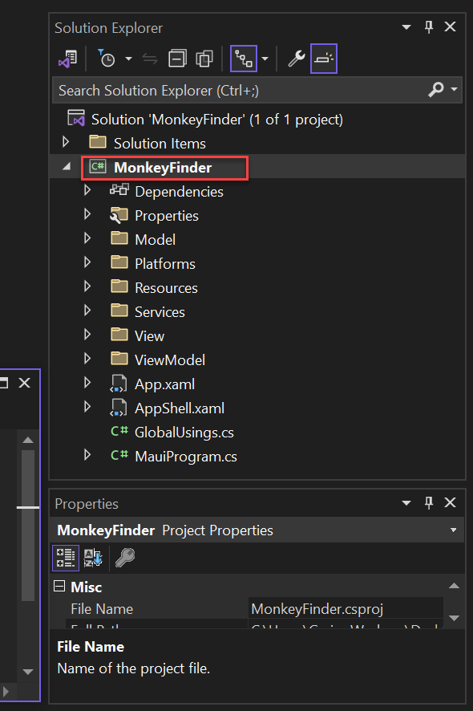
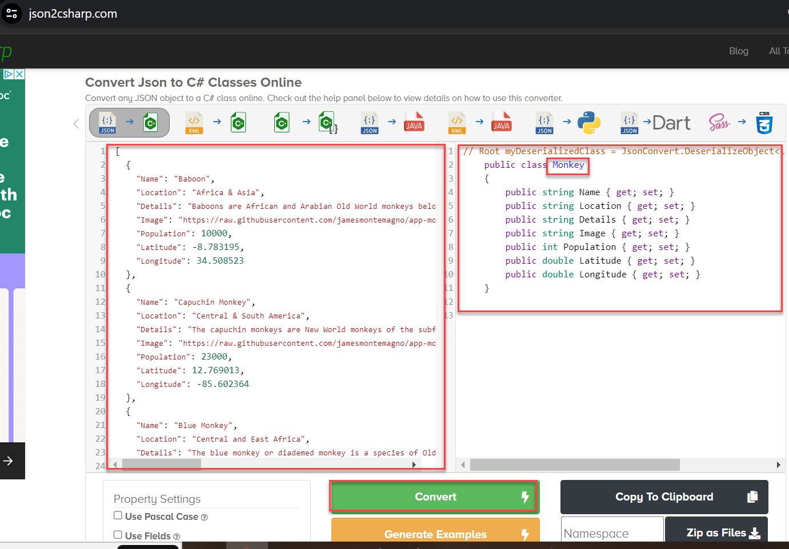
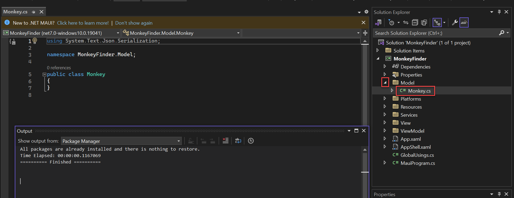
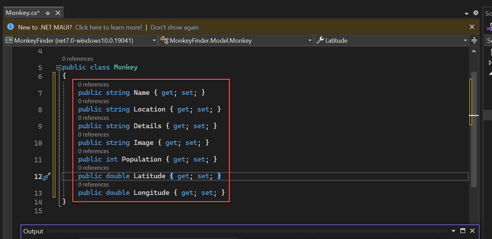
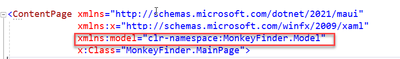
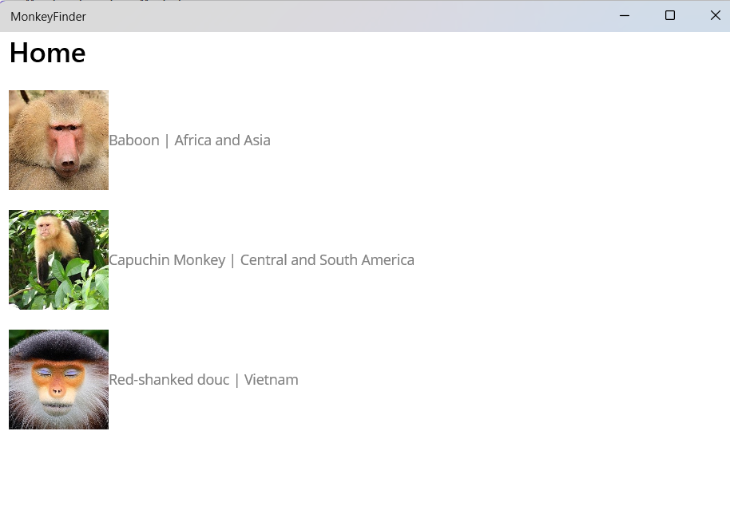
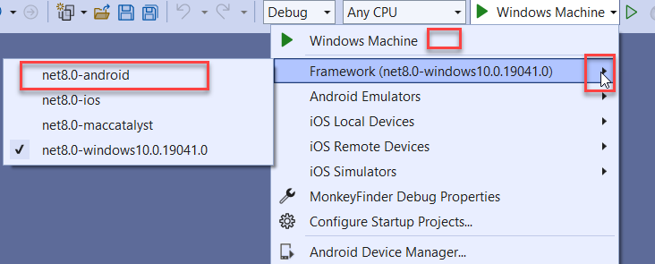
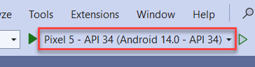

## .NET マウイ島へのオリエンテーション 

## 概要

まず、.NET MAUI の基本的な概要とプロジェクトの構造について説明します。
このセクションでは、Visual Studio 2022 を使用してソリューションをダウンロードして開く以外の作業は行いません。

### タスク 0: Visual Studio でソリューションを開く

1. MonkeyFinderソリューションをローカルにダウンロードし、ハードドライブにローカルに抽出します。  

    ```
    https://opsgilitylabs.blob.core.windows.net/public/software-dev/MonkeyFinder.zip
    ```

    **大事な！ラボ仮想マシンでの実行との違い** 

    Opsgility のホストされた仮想マシンでラボを実行している場合は、以下をお読みください。 

    1. ラボ仮想マシンで実行している場合は、ラボ プレーヤーのクラウド アイコンをクリックして、資格情報を使用して Visual Studio にログインできます。
    
    2. また、Windowsで開発者モードを有効にするように求められます。設定リンクをクリックし、プロンプトが表示されたら開発者モードを有効にします。 
    
    3. **ContentPage** と **InitializeComponent** が見つからないというエラーが表示される場合があります。これは Visual Studio の遅延であり、数分後に自動的に解決されます。 

    4. Android エマレータを実行に使用しないでください。**Windows マシン** オプションを選択して、ソリューションを開始します。

2. **MonkeyFinder.sln**を開きます。このソリューションには、Android、iOS、macOS、Windows を対象とするメインの .NET MAUI プロジェクトである **MonkeyFinder** という 1 つのプロジェクトが含まれています。これには、モデル、ビュー、ViewModels、Services など、アプリのすべてのスキャフォールディングが含まれます。

    

3. **ソリューション** を右クリックし、**再構築** を選択します。**MonkeyFinder** プロジェクトには、ラボで使用する空白のコード ファイルと XAML ページもあります。変更するすべてのコードは、ラボの期間中、このプロジェクトに含まれます。

> 情報のみ: 次のセクションでは、.NET MAUI とプロジェクトの構造について理解を深めるのに役立ちます。**タスク 1** までは、何も変更しません。

### .NET MAUI の単一プロジェクトを理解する

.NET マルチプラットフォーム アプリ UI (.NET MAUI) の 1 つのプロジェクトは、アプリの開発中に通常発生するプラットフォーム固有の開発エクスペリエンスを取得し、Android、iOS、macOS、Windows を対象とする 1 つの共有プロジェクトに抽象化します。

.NET MAUI 単一プロジェクトは、対象とするプラットフォームに関係なく、簡略化された一貫性のあるクロスプラットフォーム開発エクスペリエンスを提供します。.NET MAUI 単一プロジェクトには、次の機能があります。

- Android、iOS、macOS、Windows を対象とできる 1 つの共有プロジェクト。
- .NET MAUI アプリを実行するためのデバッグ ターゲットの選択が簡略化されました。
- 1 つのプロジェクト内の共有リソース ファイル。
- 必要に応じて、プラットフォーム固有の API とツールへのアクセス。
- 単一のクロスプラットフォーム アプリのエントリ ポイント。

.NET MAUI 単一プロジェクトは、マルチターゲットと .NET 6 の SDK スタイル プロジェクトの使用を使用して有効になります。

#### リソースファイル

クロスプラットフォーム アプリ開発のリソース管理は、従来から問題視されてきました。各プラットフォームには、リソースを管理するための独自のアプローチがあり、各プラットフォームに実装する必要があります。たとえば、プラットフォームごとに異なるimages要件があり、通常は各imagesの複数のバージョンを異なる解像度で作成する必要があります。したがって、通常、1 つのimagesをプラットフォームごとに異なる解像度で複数回複製する必要があり、結果のimagesはプラットフォームごとに異なるファイル名とフォルダの規則を使用する必要があります。

.NET MAUI 単一プロジェクトを使用すると、リソース ファイルを 1 つの場所に格納しながら、各プラットフォームで使用することができます。これには、フォント、images、アプリのアイコン、スプラッシュ画面、未加工のアセットが含まれます。

> **重要:** 各イメージ リソース ファイルはソース イメージとして使用され、ビルド時に各プラットフォームに必要な解像度のイメージが生成されます。

リソース ファイルは、.NET MAUI アプリ プロジェクトの _Resources_ フォルダー、または _Resources_ フォルダーの子フォルダーに配置し、ビルド アクションを正しく設定する必要があります。次の表は、各リソース ファイルの種類ごとのビルド アクションを示しています。

| Resource | Build action |
| -------- | ------------ |
| App icon | MauiIcon |
| Fonts | MauiFont |
| Images | MauiImage |
| Splash screen | MauiSplashScreen |
| Raw assets | MauiAsset |

<!--| CSS files | MauiCss | -->

> **注:** XAML ファイルは .NET MAUI アプリ プロジェクトにも格納され、プロジェクト テンプレートと項目テンプレートによって作成されると、**MauiXaml** ビルド アクションが自動的に割り当てられます。ただし、通常、XAML ファイルはアプリ プロジェクトの _Resources_ フォルダーには配置されません。

リソース ファイルが .NET MAUI アプリ プロジェクトに追加されると、リソースに対応するエントリがプロジェクト (.csproj) ファイルに作成されます。リソース ファイルを追加した後、そのビルド アクションを **[プロパティ]** ウィンドウで設定できます。次のスクリーンショットは、子フォルダー内のimagesリソースとフォント リソースを含む _Resources_ フォルダーを示しています。

![imagesとフォントリソースのスクリーンショット。(images/ResourcesSingleProject.png)

_Resources_ フォルダーの子フォルダーは、アプリのプロジェクト ファイルを編集して、リソースの種類ごとに指定できます。

```xml
<ItemGroup>
    <!-- Images -->
    <MauiImage Include="Resources\Images\*" />

    <!-- Fonts -->
    <MauiFont Include="Resources\Fonts\*" />

    <!-- Raw Assets (also remove the "Resources\Raw" prefix) -->
    <MauiAsset Include="Resources\Raw\**" LogicalName="%(RecursiveDir)%(Filename)%(Extension)" />
</ItemGroup>
```

ワイルドカード文字 ('*') は、フォルダ内のすべてのファイルが指定されたリソース・タイプとして扱われることを示します。さらに、子フォルダのすべてのファイルを含めることもできます。

```xml
<ItemGroup>
    <!-- Images -->
    <MauiImage Include="Resources\Images\**\*" />
</ItemGroup>
```

この例では、二重ワイルドカード文字 ('**') は、_Images_ フォルダに子フォルダを含めることができることを指定します。したがって、'<MauiImage Include="Resources\Images\**\*" />' は、_Resources\Images_ フォルダー内の任意のファイル、または _Images_ フォルダーの子フォルダーをソース イメージとして使用し、各プラットフォームに必要な解像度のイメージを生成することを指定します。

プラットフォーム固有のリソースは、対応する共有リソースよりも優先されます。たとえば、_Platforms\Android\Resources\drawable-xhdpi\logo.png_ に Android 固有のイメージがあり、共有の _Resources\Images\logo.svg_ イメージも提供している場合、プラットフォーム固有のイメージとして既に存在する XHDPI イメージを除き、必要な Android イメージの生成には Scalable Vector Graphics (SVG) ファイルが使用されます。

### アプリのアイコン

アプリ アイコンをアプリ プロジェクトに追加するには、プロジェクトの _Resources\Images_ フォルダーにimagesをドラッグし、**プロパティ** ウィンドウでアイコンのビルド アクションを **MauiIcon** に設定します。これにより、プロジェクトファイルに対応するエントリが作成されます。

```xml
<MauiIcon Include="Resources\Images\appicon.png" />
```

ビルド時に、アプリのアイコンはターゲット プラットフォームとデバイスの正しいサイズにサイズ変更されます。その後、サイズ変更されたアプリのアイコンがアプリのパッケージに追加されます。アプリ アイコンは、デバイス上やアプリ ストアでアプリを表すために使用されるなど、複数の用途があるため、複数の解像度にサイズ変更されます。

#### images

イメージをアプリ プロジェクトに追加するには、イメージをプロジェクトの _Resources\Images_ フォルダーにドラッグし、**プロパティ** ウィンドウでビルド アクションを **MauiImage** に設定します。これにより、プロジェクトファイル内のimagesごとに対応するエントリが作成されます。

```xml
<MauiImage Include="Resources\Images\logo.jpg" />
```

ビルド時に、イメージのサイズはターゲット プラットフォームとデバイスに適した解像度に変更されます。その後、サイズ変更されたimagesがアプリ パッケージに追加されます。

#### フォント

True Type 形式 (TTF) フォントと Open Type フォント (OTF) フォントをアプリ プロジェクトに追加するには、それらをプロジェクトの _Resources\Fonts_ フォルダーにドラッグし、**プロパティ** ウィンドウでビルド アクションを **MauiFont** に設定します。これにより、プロジェクトファイル内のフォントごとに対応するエントリが作成されます。

```xml
<MauiFont Include="Resources\Fonts\OpenSans-Regular.ttf" />
```

ビルド時に、フォントはアプリ パッケージにコピーされます。

<!-- 詳細については、[Fonts](~/user-interface/fonts.md) を参照してください。-->

#### スプラッシュ画面

スラッシュ画面をアプリ プロジェクトに追加するには、イメージをプロジェクトの _Resources\Images_ フォルダーにドラッグし、**プロパティ** ウィンドウでイメージのビルド アクションを **MauiSplashScreen** に設定します。これにより、プロジェクトファイルに対応するエントリが作成されます。

```xml
<MauiSplashScreen Include="Resources\Images\splashscreen.svg" />
```

ビルド時に、スプラッシュ画面のイメージは、ターゲット プラットフォームとデバイスの正しいサイズにサイズ変更されます。その後、サイズ変更されたスプラッシュ画面がアプリ パッケージに追加されます。

#### 未加工のアセット

HTML、JSON、ビデオなどの未加工のアセット ファイルをアプリ プロジェクトに追加するには、プロジェクトの _Resources_ フォルダー (または _Resources\Assets_ などのサブフォルダー) にドラッグし、**プロパティ** ウィンドウでビルド アクションを 'MauiAsset' に設定します。これにより、プロジェクトファイル内のアセットごとに対応するエントリが作成されます。

```xml
<MauiAsset Include="Resources\Assets\index.html" />
```

その後、未加工のアセットは、必要に応じてコントロールで使用できます。

'''xaml
<WebView Source="index.html" />
```

ビルド時に、未加工のアセットがアプリ パッケージにコピーされます。

### .NET MAUI アプリの起動を理解する

.NET マルチプラットフォーム アプリ UI (.NET MAUI) アプリは、.NET 汎用ホスト モデルを使用してブートストラップされます。これにより、アプリを 1 つの場所から初期化でき、フォント、サービス、サードパーティ ライブラリを構成できます。

各プラットフォームのエントリ ポイントは、静的な 'MauiProgram' クラスの 'CreateMauiApp' メソッドを呼び出し、アプリのエントリ ポイントである 'MauiApp' を作成して返します。

'MauiProgram' クラスは、少なくとも実行するアプリを提供する必要があります。

```csharp
namespace MyMauiApp;

public static class MauiProgram
{
    public static MauiApp CreateMauiApp()
    {
        var builder = MauiApp.CreateBuilder();
        builder
            .UseMauiApp<App>();

        return builder.Build();
    }
}  
```

'App' クラスは 'Application' クラスから派生します。

```csharp
namespace MyMauiApp;

public class App : Application
{
    public App()
    {
        InitializeComponent();

        MainPage = new AppShell();
    }
}
```

#### フォントを登録する

フォントはアプリに追加して、ファイル名またはエイリアスで参照できます。これは、'MauiAppBuilder' オブジェクトで 'ConfigureFonts' メソッドを呼び出すことによって実現されます。次に、'IFontCollection' オブジェクトで 'AddFont' メソッドを呼び出して、必要なフォントを追加します。

```csharp

namespace MyMauiApp;

public static class MauiProgram
{
    public static MauiApp CreateMauiApp()
    {
        var builder = MauiApp.CreateBuilder();
        builder
            .UseMauiApp<App>()
            .ConfigureFonts(fonts =>
            {
                fonts.AddFont("OpenSans-Regular.ttf", "OpenSansRegular");
            });

        return builder.Build();
    }
}
```

上記の例では、'AddFont' メソッドの最初の引数はフォント ファイル名であり、2 番目の引数は、フォントを使用するときに参照できるオプションのエイリアスを表します。

アプリで使用されるカスタム フォントは、.csproj ファイルに含める必要があります。これは、ファイル名を参照するか、ワイルドカードを使用することで実現できます。

```xml
<ItemGroup>
   <MauiFont Include="Resources\Fonts\*" />
</ItemGroup>
```

> メモ:
> Visual Studio のソリューション エクスプローラーを使用してプロジェクトに追加されたフォントは、自動的に .csproj ファイルに含まれます。

フォントは、ファイル拡張子なしでその名前を参照することで使用できます。

```xaml
<!-- Use font name -->
<Label Text="Hello .NET MAUI"
       FontFamily="OpenSans-Regular" />
```

または、エイリアスを参照して使用することもできます。

```xaml
<!-- Use font alias -->
<Label Text="Hello .NET MAUI"
       FontFamily="OpenSansRegular" />
```


.NET MAUI プロジェクトの基本的な理解ができたので、アプリの構築を始めましょう。**演習1**から始めましょう。


## 演習 1: データの表示

コーディングを始めて、リスト内のデータのリストを表示する方法を見てみましょう。

### モデル

猿に関する詳細をダウンロードし、それを表すクラスが必要になります。

1.jsonファイルを簡単に変換できます。JSON ファイルの内容をコピーし、**json2csharp.com** の **JSON** ボックスに貼り付け、**[変換]** をクリックして **Monkey** C# クラスを生成します。クラス名を **Monkey** に設定してください。右側の **C#** ボックスの内容をコピーします。

    コピー元:

    ```
    https://opsgilitylabs.blob.core.windows.net/public/software-dev/monkeydata.json
    ```

    コピー先と変換先:

    ```
    https://json2csharp.com
    ```

    

2. Visual Studio で、**Model** フォルダーを展開し、**Monkey.cs** を選択します。 

    

3. **Monkey.cs**で、**json2csharp.com**からコピーしたプロパティを次のようにファイルに貼り付けます。 

    

4. さらに、**System.Text.Json** を使用してデータを逆シリアル化するため、パフォーマンスを向上させるためにコードを動的に生成する **MonkeyContext** を追加します。次のコードはこれを有効にし、将来使用します。

    > Monkey クラスの最後の中括弧の下に次のクラスを追加します。

    ```csharp
    [JsonSerializable(typeof(List<Monkey>))]
    internal sealed partial class MonkeyContext : JsonSerializerContext
    {

    }
    ```

### データの表示

任意のデータ型のハードコーディングされたデータを、**MainPage.xaml** ファイル内の **CollectionView** に表示できます。これにより、**ItemTemplate** にいくつかの単純なimagesとラベルを設定することで、ユーザー インターフェイスを構築できます。 

1. **Visual Studio** で **MainPage.xaml** を選択します。

    

2. まず、**MainPage.xaml** の ContentPage 要素の属性として新しい名前空間を追加する必要があります。これにより、データバインディングの目的で上記のMonkeyクラスを参照できるようになります。

    ```xml
    xmlns:model="clr-namespace:MonkeyFinder.Model"
    ```

    

3. MainPage.xaml の **ContentPage** に次のものを追加します。

    ```xml
    <CollectionView>
        <CollectionView.ItemsSource>
            <x:Array Type="{x:Type model:Monkey}">
                <model:Monkey
                    Name="Baboon"
                    Image="https://raw.githubusercontent.com/jamesmontemagno/app-monkeys/master/baboon.jpg"
                    Location="Africa and Asia" />
                <model:Monkey
                    Name="Capuchin Monkey"
                    Image="https://raw.githubusercontent.com/jamesmontemagno/app-monkeys/master/capuchin.jpg"
                    Location="Central and South America" />
                <model:Monkey
                    Name="Red-shanked douc"
                    Image="https://raw.githubusercontent.com/jamesmontemagno/app-monkeys/master/douc.jpg"
                    Location="Vietnam" />
            </x:Array>
        </CollectionView.ItemsSource>
        <CollectionView.ItemTemplate>
            <DataTemplate x:DataType="model:Monkey">
                <HorizontalStackLayout Padding="10">
                    <Image
                        Aspect="AspectFill"
                        HeightRequest="100"
                        Source="{Binding Image}"
                        WidthRequest="100" />
                    <Label VerticalOptions="Center" TextColor="Gray">
                        <Label.Text>
                            <MultiBinding StringFormat="{}{0} | {1}">
                                <Binding Path="Name" />
                                <Binding Path="Location" />
                            </MultiBinding>
                        </Label.Text>
                    </Label>
                </HorizontalStackLayout>
            </DataTemplate>
        </CollectionView.ItemTemplate>
    </CollectionView>
    ```
### アプリを実行する

さまざまなプラットフォームにデプロイしてデバッグするためのマシンが設定されていることを確認します。


1. **Windows マシン** をクリックしてアプリのデバッグを開始し、アプリを Windows アプリとして表示します。 

    


> リマインダー: ラボ仮想マシンを使用している場合は、この手順をスキップしてください。 

1. Visual Studioで、デバッグプロンプト(Windowsマシン)の横にある下向き矢印をクリックして、Androidエミュレータに変更します。[フレームワーク] の横の矢印をクリックし、[**net8.0-android** ] を選択します。

    

1.検査後、アプリケーションを閉じます。

1. 「Pixel 5 - API 34」ボタンをクリックして、Android Emulator を使用してアプリのデバッグを開始します。 

    

    

>注:Androidを選択したら、デフォルトのオプションに従ってください。ダウンロードと解凍には数分かかります。
