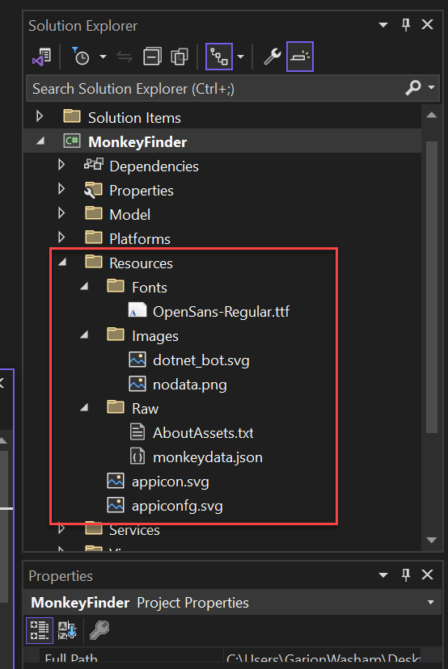

## .NET Maui のオリエンテーション

## 概要

.NET MAUI の基本概要とプロジェクトの構造を確認しましょう。
このセクションでは、Visual Studio 2022 を使用してソリューションをダウンロードして開くこと以外の作業はありません。

### タスク 0: Visual Studioでソリューションを開く

1. MonkeyFinderソリューションをローカルにダウンロードし、ハードドライブにローカルに抽出します。  

    ```
    https://opsgilitylabs.blob.core.windows.net/public/software-dev/MonkeyFinder.zip
    ```

    **重要！ ラボ仮想マシンでの実行に関する違い**

    Opsgilityでホストされている仮想マシンでラボを実行している場合は、以下をお読みください:

    1. ラボ仮想マシンで実行している場合は、ラボプレイヤーのクラウドアイコンをクリックして、Visual Studioにログインするための認証情報を使用できます。
    
    2. Windowsで開発者モードを有効にするように求められます。設定リンクをクリックして、プロンプトに従って開発者モードを有効にしてください。
    
    3. **ContentPage**や**InitializeComponent**が見つからないというエラーが表示されることがあります。これはVisual Studioの遅延によるもので、数分後に自動的に解決されます。
    
    4. 実行にはAndroidエミュレータを使用しないでください。**Windows Machine**オプションを選択してソリューションを開始してください。

2. **MonkeyFinder.sln**を開きます。このソリューションには1つのプロジェクト、**MonkeyFinder** が含まれており、これはAndroid、iOS、macOS、Windowsをターゲットとする主要な.NET MAUIプロジェクトです。このプロジェクトには、モデル、ビュー、ビューモデル、サービスなどアプリのためのすべてのスキャフォールディングが含まれています。

    

3. **ソリューション**を右クリックして**Rebuild**を選択します。**MonkeyFinder**プロジェクトには、ラボの間に使用する空のコードファイルとXAMLページも含まれています。ラボの期間中、私たちが変更するコードはすべてこのプロジェクト内にあります。

> 情報のみ: 次のセクションは、.NET MAUIとプロジェクト構造について理解を深めるためのものです。**タスク1**までは変更を加えないでください。

### .NET MAUIシングルプロジェクトの理解

.NET Multi-platform App UI (.NET MAUI)のシングルプロジェクトは、通常アプリ開発で遭遇するプラットフォーム固有の開発体験を抽象化し、Android、iOS、macOS、Windowsをターゲットとする単一の共有プロジェクトにまとめます。

.NET MAUIのシングルプロジェクトは、ターゲットとなるプラットフォームに関係なく、シンプルで一貫性のあるクロスプラットフォームの開発体験を提供します。.NET MAUIシングルプロジェクトは次の機能を提供します:

- Android、iOS、macOS、Windowsをターゲットとする単一の共有プロジェクト。
- .NET MAUIアプリを実行するための簡素化されたデバッグターゲットの選択。
- シングルプロジェクト内の共有リソースファイル。
- 必要に応じてプラットフォーム固有のAPIやツールにアクセス。
- 単一のクロスプラットフォームアプリのエントリーポイント。

.NET MAUIシングルプロジェクトは、マルチターゲティングと.NET 6のSDKスタイルプロジェクトの使用により有効化されています。

#### リソースファイル

クロスプラットフォームアプリ開発におけるリソース管理は、従来から問題がありました。各プラットフォームにはリソース管理の独自の方法があり、各プラットフォームで実装する必要があります。例えば、各プラットフォームは異なる画像要件があり、通常、異なる解像度で各画像の複数バージョンを作成する必要があります。そのため、単一の画像は通常、各プラットフォームで異なる解像度で複数回複製され、結果として異なるファイル名やフォルダの命名規則を各プラットフォームごとに使用する必要があります。

.NET MAUIシングルプロジェクトでは、フォント、画像、アプリアイコン、スプラッシュ画面、未加工のアセットなど、リソースファイルを単一の場所に保存し、各プラットフォームで利用できるようにしています。

> **重要:** 各画像リソースファイルは、必要な解像度の画像がビルド時に各プラットフォームで生成される元の画像として使用されます。

リソースファイルは.NET MAUIアプリプロジェクトの _Resources_ フォルダ、または _Resources_ フォルダのサブフォルダに配置する必要があり、ビルドアクションを正しく設定する必要があります。以下の表は、各リソースファイルタイプのビルドアクションを示しています:

| リソース | ビルドアクション |
| -------- | ------------ |
| アプリアイコン | MauiIcon |
| フォント | MauiFont |
| 画像 | MauiImage |
| スプラッシュ画面 | MauiSplashScreen |
| 未加工アセット | MauiAsset |

<!--| CSSファイル | MauiCss | -->

> **注意:** XAMLファイルも.NET MAUIアプリプロジェクト内に保存されており、プロジェクトやアイテムテンプレートによって作成されるときに自動的に**MauiXaml**ビルドアクションが割り当てられます。ただし、XAMLファイルは通常、アプリプロジェクトの _Resources_ フォルダには配置されません。

リソースファイルが.NET MAUIアプリプロジェクトに追加されると、プロジェクト (.csproj) ファイルに対応するリソースエントリが作成されます。リソースファイルを追加した後、ビルドアクションは**プロパティ**ウィンドウで設定できます。以下のスクリーンショットは、子フォルダ内に画像およびフォントリソースを含む _Resources_ フォルダを示しています:



アプリのプロジェクトファイルを編集することで、_Resources_ フォルダの子フォルダを各リソースタイプ用に指定できます:

```xml
<ItemGroup>
    <!-- 画像 -->
    <MauiImage Include="Resources\Images\*" />

    <!-- フォント -->
    <MauiFont Include="Resources\Fonts\*" />

    <!-- 未加工アセット（また、「Resources\Raw」プレフィックスも削除） -->
    <MauiAsset Include="Resources\Raw\**" LogicalName="%(RecursiveDir)%(Filename)%(Extension)" />
</ItemGroup>

ワイルドカード文字 (*) は、フォルダ内のすべてのファイルが指定されたリソースタイプとして扱われることを示します。さらに、子フォルダ内のすべてのファイルを含めることも可能です:

<ItemGroup>
    <!-- 画像 -->
    <MauiImage Include="Resources\Images\**\*" />
</ItemGroup>

この例では、二重ワイルドカード文字（'**'）により、Images フォルダに子フォルダを含めることができます。そのため、<MauiImage Include="Resources\Images\**\*" />は、Resources\Images フォルダまたは Images フォルダの任意の子フォルダ内のすべてのファイルを指定し、必要な解像度の画像が各プラットフォーム用に生成される元の画像として使用します。

プラットフォーム固有のリソースは、共有リソースと比較して優先的に使用されます。例えば、Android固有の画像が Platforms\Android\Resources\drawable-xhdpi\logo.png に配置され、共有 Resources\Images\logo.svg 画像も提供されている場合、スケーラブルベクターグラフィックス（SVG）ファイルが必要なAndroid画像の生成に使用されますが、XHDPI画像は既存のプラットフォーム固有の画像として優先されます。

### アプリアイコン

アプリアイコンをアプリプロジェクトに追加するには、画像をプロジェクトの _Resources\Images_ フォルダにドラッグし、**プロパティ**ウィンドウでアイコンのビルドアクションを **MauiIcon** に設定します。これにより、プロジェクトファイルに対応するエントリが作成されます:

```xml
<MauiIcon Include="Resources\Images\appicon.png" />
```

ビルド時に、アプリアイコンはターゲットプラットフォームやデバイスに適したサイズにリサイズされます。リサイズされたアプリアイコンはアプリパッケージに追加されます。アプリアイコンは、デバイス上でアプリを表すためやアプリストアで使用されるなど、複数の用途があるため、複数の解像度にリサイズされます。

#### 画像

画像をアプリプロジェクトに追加するには、画像をプロジェクトの _Resources\Images_ フォルダにドラッグし、**プロパティ**ウィンドウでビルドアクションを **MauiImage** に設定します。これにより、各画像に対応するエントリがプロジェクトファイルに作成されます:

```xml
<MauiImage Include="Resources\Images\logo.jpg" />
```

ビルド時に、画像はターゲットプラットフォームやデバイスに適した解像度にリサイズされます。リサイズされた画像はアプリパッケージに追加されます。

#### フォント

True Type形式（TTF）およびOpenTypeフォント（OTF）フォントは、プロジェクトの _Resources\Fonts_ フォルダにドラッグし、**プロパティ**ウィンドウでビルドアクションを **MauiFont** に設定することでアプリプロジェクトに追加できます。これにより、各フォントに対応するエントリがプロジェクトファイルに作成されます:

```xml
<MauiFont Include="Resources\Fonts\OpenSans-Regular.ttf" />
```

ビルド時に、フォントはアプリパッケージにコピーされます。

<!-- 詳細については、[フォント](~/user-interface/fonts.md) を参照してください。 -->

#### スプラッシュ画面

スプラッシュ画面は、画像をプロジェクトの _Resources\Images_ フォルダにドラッグし、**プロパティ**ウィンドウで画像のビルドアクションを **MauiSplashScreen** に設定することでアプリプロジェクトに追加できます。これにより、プロジェクトファイルに対応するエントリが作成されます:

```xml
<MauiSplashScreen Include="Resources\Images\splashscreen.svg" />
```

ビルド時に、スプラッシュ画面の画像はターゲットプラットフォームやデバイスに適したサイズにリサイズされます。リサイズされたスプラッシュ画面はアプリパッケージに追加されます。

#### 未加工アセット

HTML、JSON、ビデオなどの未加工アセットファイルは、プロジェクトの _Resources_ フォルダ（または _Resources\Assets_ のようなサブフォルダ）にドラッグし、**プロパティ**ウィンドウでビルドアクションを `MauiAsset` に設定することでアプリプロジェクトに追加できます。これにより、各アセットに対応するエントリがプロジェクトファイルに作成されます:

```xml
<MauiAsset Include="Resources\Assets\index.html" />
```

未加工アセットは、必要に応じてコントロールによって利用できます:

```xaml
<WebView Source="index.html" />
```

ビルド時に、未加工アセットはアプリパッケージにコピーされます。

### .NET MAUIアプリの起動の理解

.NET Multi-platform App UI (.NET MAUI) アプリは、.NET Generic Hostモデルを使用してブートストラップされます。これにより、アプリを単一の場所から初期化でき、フォント、サービス、サードパーティライブラリを構成する機能が提供されます。

各プラットフォームのエントリポイントは、`MauiProgram` クラスの静的メソッド `CreateMauiApp` を呼び出し、`MauiApp` を作成して返します。これがアプリのエントリポイントです。

`MauiProgram` クラスは、最低限実行するアプリを提供する必要があります:

```csharp
namespace MyMauiApp;

public static class MauiProgram
{
    public static MauiApp CreateMauiApp()
    {
        var builder = MauiApp.CreateBuilder();
        builder
            .UseMauiApp<App>();

        return builder.Build();
    }
}  

App クラスは Application クラスから派生します:

```csharp
namespace MyMauiApp;

public class App : Application
{
    public App()
    {
        InitializeComponent();

        MainPage = new AppShell();
    }
}
```

#### フォントの登録

フォントは、アプリに追加し、ファイル名やエイリアスで参照できます。これは、`MauiAppBuilder` オブジェクトの `ConfigureFonts` メソッドを呼び出すことで実現します。その後、`IFontCollection` オブジェクトで `AddFont` メソッドを呼び出し、必要なフォントを追加します:

```csharp

namespace MyMauiApp;

public static class MauiProgram
{
    public static MauiApp CreateMauiApp()
    {
        var builder = MauiApp.CreateBuilder();
        builder
            .UseMauiApp<App>()
            .ConfigureFonts(fonts =>
            {
                fonts.AddFont("OpenSans-Regular.ttf", "OpenSansRegular");
            });

        return builder.Build();
    }
}
```

上記の例では、AddFont メソッドの最初の引数がフォントのファイル名で、2番目の引数が、フォントを使用する際に参照できるオプションのエイリアスです。

アプリで使用するカスタムフォントは、.csproj ファイルに含める必要があります。これは、ファイル名を参照するか、ワイルドカードを使用して実現できます:

```xml
<ItemGroup>
   <MauiFont Include="Resources\Fonts\*" />
</ItemGroup>
```

注意: Visual Studioのソリューションエクスプローラーを通じてプロジェクトに追加されたフォントは、自動的に.csprojファイルに含まれます。

その後、ファイル拡張子なしでフォント名を参照することでフォントを使用できます:

```xaml
<!-- フォント名を使用 -->
<Label Text="Hello .NET MAUI"
       FontFamily="OpenSans-Regular" />
```

または、エイリアスを参照して使用することもできます:

```xaml
<!-- フォントエイリアスを使用 -->
<Label Text="Hello .NET MAUI"
       FontFamily="OpenSansRegular" />
```

これで、.NET MAUI プロジェクトの基本的な理解ができました。さっそくアプリの構築を始めましょう！エクササイズ 1 から始めます。

